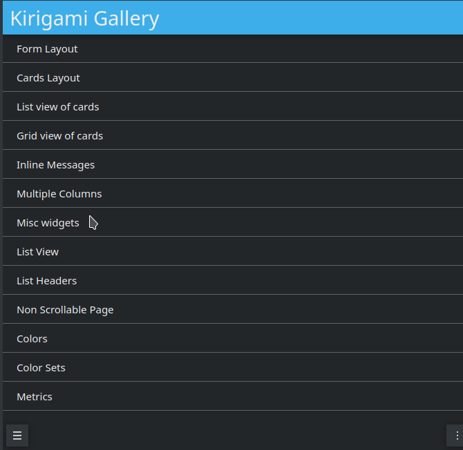
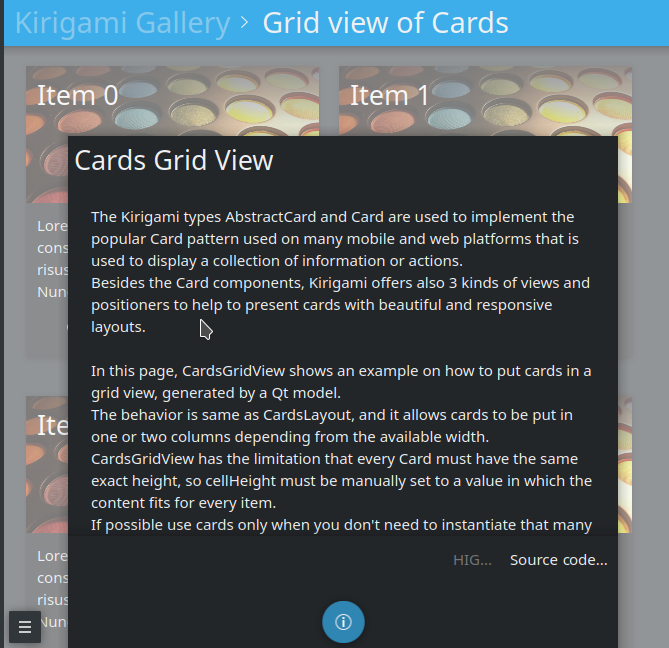
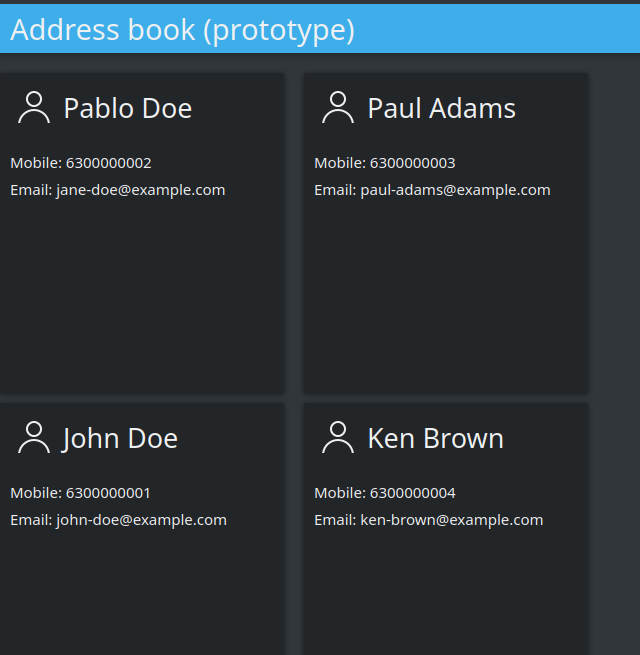
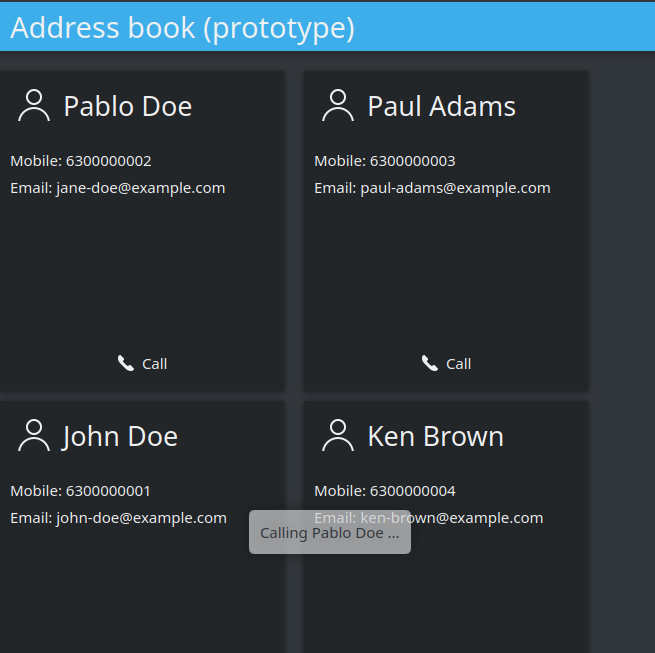

Application development
=======================

Getting involved with Plasma Mobile application environment is a perfect
opportunity to familiarize with a set of important technologies:

-  Qt, the cross-platform application framework for creating
   applications that run on various software and hardware platforms with
   little or no change in the underlying codebase
-  QML, the UI specification and programming language that allows
   designers and developers to create applications with fluid
   transitions and effects, which are quite popular in mobile devices.
   QML is a declarative language offering a highly readable,
   declarative, JSON-like syntax with support for imperative JavaScript
   expressions.
-  Qt Quick, the standard library of types and functionality for QML. It
   includes, among many others, visual types, interactive types,
   animations, models and views. A QML application developer can get
   access this functionality with a single import statement.
-  CMake, the cross-platform set of tools designed to build, test and
   package software, using a compiler-independent method.
-  Kirigami, a set of QtQuick components, facilitating the easy creation
   of applications that look and feel great on mobile as well as on
   desktop devices, following the KDE Human Interface Guidelines.

Documentation resources
~~~~~~~~~~~~~~~~~~~~~~~

In this section you will find a set of technical resources that will
accompany you during your journey as a Plasma Mobile developer. If you
are just starting out with Qt, QML and CMake, you will find here enough
detail so as to feel comfortable with the technologies related to Plasma
Mobile development. If you are an experienced Qt developer, you can find
here valuable resources so as to comply with best practices.

QtQuick and QML
^^^^^^^^^^^^^^^

-  `QML Applications <https://doc.qt.io/qt-5/qmlapplications.html>`__
-  `First Steps with QML <https://doc.qt.io/qt-5/qmlfirststeps.html>`__
-  `Getting Started Programming with Qt
   Quick <https://doc.qt.io/qt-5/qtdoc-tutorials-alarms-example.html>`__
-  `QML Glossary <https://doc.qt.io/qt-5/qml-glossary.html>`__
-  `QML Reference <https://doc.qt.io/qt-5/qmlreference.html>`__
-  `QML types list <https://doc.qt.io/qt-5/qmltypes.html>`__
-  `QML introduction video series <https://www.youtube.com/playlist?list=PL6CJYn40gN6hdNC1IGQZfVI707dh9DPRc>`__

Kirigami
^^^^^^^^

- `Kirigami Tutorials <https://develop.kde.org/docs/kirigami/>`__
-  `Kirigami Human Interface
   Guidelines <https://community.kde.org/KDE_Visual_Design_Group/KirigamiHIG>`__
-  `Kirigami
   API <https://api.kde.org/frameworks/kirigami/html/index.html>`__

CMake
^^^^^

-  `CMake Documentation <https://cmake.org/documentation/>`__
-  `CMake Guidelines and
   How-tos <https://community.kde.org/Guidelines_and_HOWTOs/CMake>`__

Create the application template
~~~~~~~~~~~~~~~~~~~~~~~~~~~~~~~

We will use the KDE flatpak SDK to develop and package the app, so all
that is required is a working flatpak and flatpak-builder installation.

To install flatpak on your workstation, follow the official instructions provided `here <https://flatpak.org/setup/>`__.

.. note:: If you prefer to set up the environment yourself instead of using the SDK, see `the KDE Community wiki <https://community.kde.org/Guidelines_and_HOWTOs/CMake#Building_with_CMake_in_short>`__.

.. tip:: Before starting, please ensure that your system is already set up as described `here <https://community.kde.org/Guidelines_and_HOWTOs/Flatpak>`__.

First, clone the app template:
``git clone https://invent.kde.org/jbbgameich/plasma-mobile-app-template.git``

This repository can be used as a template to develop Plasma Mobile
applications. It already includes templates for the qml ui, a c++ part,
app metadata and flatpak packaging.

Build the application locally using the KDE flatpak SDK
^^^^^^^^^^^^^^^^^^^^^^^^^^^^^^^^^^^^^^^^^^^^^^^^^^^^^^^

Install and build dependencies
------------------------------

The following command installs the required dependencies into the ``flatpak-build-desktop`` directory.
It needs to be run each time you change dependencies in your json manifest.

.. code-block:: bash

   flatpak-builder --install-deps-from=flathub --stop-at=hellokirigami flatpak-build-desktop *.json

Build your application
----------------------

Now that dependencies are installed, you can build your app using the KDE SDK.
KDE applications typically require an out-of-source build, so let's create a build dependency first.

.. code-block:: bash

   mkdir build
   cd build

The app template uses the cmake build system, which we can use to generate the necessary files needed to build the application.
This step works almost like building without the KDE flatpak SDK, except for the addition of ``flatpak build ${FLATPAK_BUILD_DIRECTORY}``.

.. code-block:: bash

   flatpak build ../flatpak-build-desktop cmake .. -DCMAKE_INSTALL_PREFIX:PATH=/app -G Ninja

Finally, we can compile the code using ninja.

.. code-block:: bash

   flatpak build ../flatpak-build-desktop ninja install

You can now run your application in the SDK environment.
Later ``hellokirigami`` needs to be replaced with the name you chose for your application.

.. code-block:: bash

   flatpak-builder --run ../flatpak-build-desktop ../*.json hellokirigami

If you can see this image:

.. figure:: Hellokirigami.png
   :alt: Hellokirigami.png
   :width: 250px

   Hellokirigami.png

you have successfully created your first Plasma Mobile application!

Build the application for the phone
^^^^^^^^^^^^^^^^^^^^^^^^^^^^^^^^^^^

Make sure your system supports qemu user emulation. If not, you can find
help for example `here. <https://wiki.debian.org/QemuUserEmulation>`__

.. code-block:: bash

   flatpak-builder  --install-deps-from=flathub flatpak-build-phone --repo=arm-phone --arch=arm --force-clean --ccache *.json
   flatpak build-bundle arm-phone hellokirigami.flatpak org.kde.hellokirigami --arch=arm

Now your app is exported into app.flatpak. You can copy the file to the
phone using scp:

.. code-block:: bash

   scp app.flatpak phablet@10.15.19.82:/home/phablet/app.flatpak

.. code-block:: bash

   ssh phablet@10.15.19.82
   flatpak install app.flatpak

Your new application should now appear on the homescreen.

Customize the application template
^^^^^^^^^^^^^^^^^^^^^^^^^^^^^^^^^^

Edit the files to fit your naming and needs. In each command, replace
“io.you.newapp” and “newapp” with the id and name you want to use.

.. code-block:: bash

   sed -i 's/org.kde.hellokirigami/org.kde.kirigami-tutorial/g;s/[Hh]ello[Kk]irigami/newapp/g' $(find . -name "CMakeLists.txt" -or -name "*.desktop" -or -name "*.xml" -or -name "*.json"  -or -name *.cpp)

   for file in $(find . -name "org.kde.hellokirigami*"); do mv $file $(echo $file | sed 's/org.kde.hellokirigami/io.you.newapp/g'); done

Upload application to repository
~~~~~~~~~~~~~~~~~~~~~~~~~~~~~~~~

Once your application is working and is usable, you can submit a patch
to include it into the KDE flatpak repository.

``git clone https://invent.kde.org/packaging/flatpak-kde-applications && cd flatpak-kde-applications``

Paste the following content into the file:

.. code-block:: bash

   ID=io.you.newapp
   JSON=io.you.newapp.json
   GITURL=https://invent.kde.org/you/newapp.git

Once your merge request is accepted, your app will be automatically built, published and made
available in Discover (if the KDE flatpak repository is enabled on the
device).

Create a Kirigami application
~~~~~~~~~~~~~~~~~~~~~~~~~~~~~

In this tutorial we will use some of the technologies already presented in the `application development <AppDevelopment.html>`_ section. Before starting, you should follow the instructions in that page since the hellokirigami prototype will be used as a skeleton for our development.

Rename the prototype
^^^^^^^^^^^^^^^^^^^^

At first, we will change the name used in the plasma-mobile-app-template from hellokirigami to kirigami-tutorial:

.. code-block:: bash

   sed -i 's/org.kde.hellokirigami/org.kde.kirigami-tutorial/g;s/[Hh]ello[Kk]irigami/kirigami-tutorial/g' $(find . -name "CMakeLists.txt" -or -name "*.desktop" -or -name "*.xml" -or -name "*.json"  -or -name *.cpp)

   for file in $(find . -name "org.kde.hellokirigami*"); do mv $file $(echo $file | sed 's/org.kde.hellokirigami/org.kde.kirigami-tutorial/g'); done

Objective
^^^^^^^^^
Our goal is to create a simple prototype of an address book. We need to display a grid of cards that will show the contacts of our phone. Each card should display the name of the contact, her/his mobile phone and the email address.

Kirigami Gallery
^^^^^^^^^^^^^^^^
Now that the requirements of our project have been defined we need to find out the technologies that will help us to create the prototype. In this task `Kirigami Gallery <https://cgit.kde.org/kirigami-gallery.git/>`_ will be our friend. Kirigami Gallery is an application which uses the features of Kirigami, provides links to the source code, tips on how to use the components as well as links to the corresponding HIG pages.

.. tip:: Before continuing please install Kirigami Gallery. It should already be in the repository of your GNU Linux distribution.

Find a card grid
^^^^^^^^^^^^^^^^
Navigating through the Kirigami Gallery application, we will stumble upon the "Grid view of cards" gallery component. This is a good candidate that serves our purpose; to display a grid of contact cards.

   List of kirigami gallery components

After selecting the "Grid view of cards" gallery component, we will click to the bottom action and we will get some useful information about the Card and Abstract Card types.

   Kirigami gallery grid view

In this information dialog we will also find a link to the source code of the Cards Grid View. Let's navigate to this page.

Implement the card grid
^^^^^^^^^^^^^^^^^^^^^^^
We will reuse the most of the code found in the Cards Grid View Gallery `source code page <https://cgit.kde.org/kirigami-gallery.git/tree/src/data/contents/ui/gallery/CardsGridViewGallery.qml>`_. In particular, we will remove the extra parts of the OverlaySheet (which is the implementation of the Kirigami Gallery that helped us reach the kirigami-gallery source code repository).

So, we are going to substitute the Page component of main.qml of the skeleton app with the below Scrollable Page:

.. code-block:: qml

    Kirigami.ScrollablePage {

        title: "Address book (prototype)"

        Kirigami.CardsGridView {
            id: view

            model: ListModel {
                id: mainModel
            }

            delegate: card
        }
    }

What we have done so far is to create a :kirigamiapi:`ScrollablePage <ScrollablePage>` and put into it a :kirigamiapi:`CardsGridView <CardsGridView>`, since we want to display a grid of Cards generated from a model. The data of each contact is provided by a `ListModel <https://doc.qt.io/qt-5/qml-qtqml-models-listmodel.html>`_ while the card delegate is responsible for the presentation of the data. For more info about models and views in Qt Quick, see `here <https://doc.qt.io/qt-5/qtquick-modelviewsdata-modelview.html>`_.

Now let's populate the model that will feed our grid view with data. In :kirigamiapi:`Kirigami.ScrollablePage <ScrollablePage>` definition, just after:

.. code-block:: qml

      delegate: card
    }

add the below:

.. code-block:: qml

    Component.onCompleted: {
        mainModel.append({"firstname": "Pablo", "lastname": "Doe", "cellphone": "6300000002", "email" : "jane-doe@example.com", "photo": "qrc:/konqi.jpg"});
        mainModel.append({"firstname": "Paul", "lastname": "Adams", "cellphone": "6300000003", "email" : "paul-adams@example.com", "photo": "qrc:/katie.jpg"});
        mainModel.append({"firstname": "John", "lastname": "Doe", "cellphone": "6300000001", "email" : "john-doe@example.com", "photo": "qrc:/konqi.jpg"});
        mainModel.append({"firstname": "Ken", "lastname": "Brown", "cellphone": "6300000004", "email" : "ken-brown@example.com", "photo": "qrc:/konqi.jpg"});
        mainModel.append({"firstname": "Al", "lastname": "Anderson", "cellphone": "6300000005", "email" : "al-anderson@example.com", "photo": "qrc:/katie.jpg"});
        mainModel.append({"firstname": "Kate", "lastname": "Adams", "cellphone": "6300000005", "email" : "kate-adams@example.com", "photo": "qrc:/konqi.jpg"});
    }

The model part of our implementation is ready. Let's proceed to defining a delegate that will be responsible for displaying the data. So, we add the below code to the main.qml page, just after the Component.onCompleted definition:

.. code-block:: qml

    Component {
        id: card

        Kirigami.Card {

            height: view.cellHeight - Kirigami.Units.largeSpacing

            banner {
                title: model.firstname + " " + model.lastname
                titleIcon: "im-user"
            }

            contentItem: Column {
                id: content

                spacing: Kirigami.Units.smallSpacing

                Controls.Label {
                    wrapMode: Text.WordWrap
                    text: "Mobile: " + model.cellphone
                }

                Controls.Label {
                    wrapMode: Text.WordWrap
                    text: "Email: " + model.email
                }
            }
        }
    }

Following the relative information in the `api page <https://api.kde.org/frameworks/kirigami/html/classorg_1_1kde_1_1kirigami_1_1Card.html>`_ we populate a "banner" (although without an image yet), that will act as a header that will display the name of the contact as well as a contact icon.

The main content of the card has been populated with the cell phone number and the email of the contact, structured as a `column <https://doc.qt.io/qt-5/qml-qtquick-column.html>`_ of `labels <https://doc.qt.io/qt-5/qml-qtquick-controls2-label.html>`_.

The application should look like this:

   Simple grid of cards

.. tip:: You can find the full source code of the tutorial at `invent.kde.org <https://invent.kde.org/dkardarakos/kirigami-tutorial>`_.

As a last step we will add some dummy functionality to each card. In particular, a "call" action will be added. Nevertheless, instead of a real call, a passive notification will be displayed. So, let's change the card Component to the below:

.. code-block:: qml

    Component {
        id: card

        Kirigami.Card {

            height: view.cellHeight - Kirigami.Units.largeSpacing

            banner {
                title: model.firstname + " " + model.lastname
                titleIcon: "im-user"
            }

            contentItem: Column {
                id: content

                spacing: Kirigami.Units.smallSpacing

                Controls.Label {
                    wrapMode: Text.WordWrap
                    text: "Mobile: " + model.cellphone
                }

                Controls.Label {
                    wrapMode: Text.WordWrap
                    text: "Email: " + model.email
                }
            }

            actions: [
                Kirigami.Action {
                    text: "Call"
                    icon.name: "call-start"

                    onTriggered: { showPassiveNotification("Calling " + model.firstname + " " + model.lastname + " ...") }
                }
            ]
        }
    }

So, we added an `action <https://api.kde.org/frameworks/kirigami/html/classorg_1_1kde_1_1kirigami_1_1Action.html>`_  that, as soon as it is triggered (by pressing the action button), a `passive notification <https://api.kde.org/frameworks/kirigami/html/classorg_1_1kde_1_1kirigami_1_1AbstractApplicationWindow.html#a0a31a7c36993433b260f27ef9b7b9be1>`_ is displayed.

Finally, our application should look like this:

   Grid with calling action triggered
