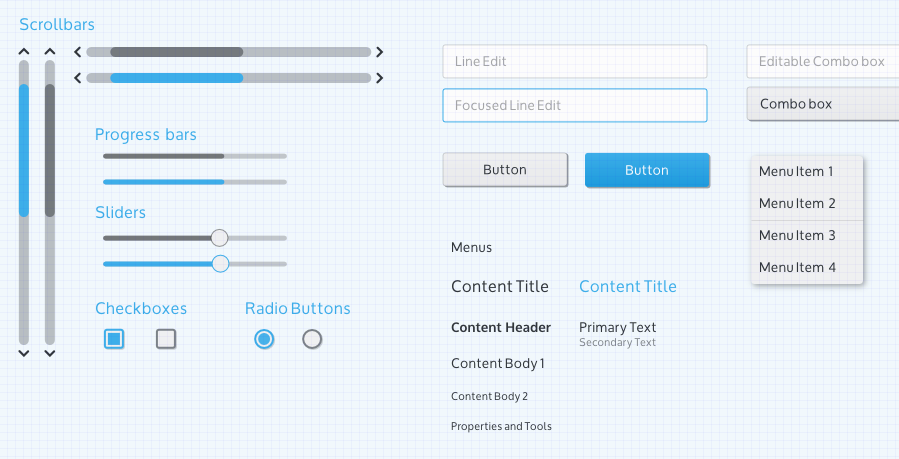
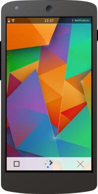

Plasma Mobile is developed in a design-driven workflow. We design
features and applications with Plasma Mobiles core concerns of
functionality and privacy and design the apps fitting to different form
factors. Apps or system components can be specific for a device such as
a smartphone, but may also be applicable and useful on other types of
devices, such as laptops.

Design process
--------------

This design process is iterative in nature and combines input from
interaction designers, visual designers and developers in all stages. A
guideline for a design process looks could be:

Requirements analysis
~~~~~~~~~~~~~~~~~~~~~

The first step to building an application is to analyze the problem that
you want to solve and come up with a way how you can solve this problem.
This allows you to make a list of required features for your
application. A clear purpose and understanding of what want to achieve
and how you want to get there helps you to make smart choices regarding
features, their design and presentation. It can also avoid bloat and
helps to set priorities for the app's development work.

In this phase, try to answer the following questions:

-  Which problem do we want to solve?
-  How do we want to solve this problem (may be on an abstract level)?
-  Which user-facing functional changes do we want to make?

Interaction design
~~~~~~~~~~~~~~~~~~

In the interaction design stage, the requirements are translated into
functional additions or changes.

-  How does the user "experience" the described functionality?
-  Where does the new feature fit into the application's workflow?
-  How should this be presented in terms of interactive controls?
-  Which options should be provided?
-  How can these actions be labeled and presented to the user in a
   self-explanatory way?

Visual design
~~~~~~~~~~~~~

The visual design stage is all about how it should look on the screen.
Relevant questions that should be answered in this stage are:

-  How should the wanted functionality be presented?
-  Which graphical elements are necessary for functional and visual
   aspects of the new feature?
-  Which supporting hints, such as animation or transition effects
   should be provided, and which function do they serve?
-  Which graphical elements are necessary, on top of existing theming
   and graphical elements
-  Mockups are useful tools to convey results of this stage in order to
   move on to the next stage.

Implementation
~~~~~~~~~~~~~~

In this stage, the developer works on the code for the application,
getting feedback or additional details from the previous stages. This
work can be done based on mockups and it's generally helpful when
someone has already thought of which UI options should be found where.
Good presentations of the design work help developers to make smart
choices in the architecture. Developers are usually happy to receive
mockups that look good, and try to make the resulting UI match (or
exceed) the ideas of the designers.

Review
~~~~~~

In this stage, we have a critical look at the result of the
implementation and look how it can be improved or polished further.
Review should blend into the implementation stage as soon as possible,
as to steer the development of the UI in the expected direction.

Profit!
~~~~~~~

The feature reaches the user, through testing packages and eventually in
a stable release, via system images, packages or app stores. This is
just the beginning, since it's the point where feedback comes in, often
in the form of bugreports, but also regularly in comments from ragingly
enthusiast users that appreciate the work done. Time to think about the
next iteration, how can the feature be made more valuable, better
understandable, or just a lot more appealing or useful?

Design tools
------------

The following tools help you to design a well-integrated, good looking
and functional application or feature.

Vision statement
~~~~~~~~~~~~~~~~

Plasma Mobile is designed based on the following vision statement:
"*Plasma Mobile aims to become a complete software system for mobile
devices. It is designed to give privacy-aware users back the
full-control over their information and communication. Plasma Mobile
takes a pragmatic approach and is inclusive to 3rd party software,
allowing the user to choose which applications and services to use. It
provides a seamless experience across multiple devices.* *Plasma Mobile
implements open standards and it is developed in a transparent process
that is open for the community to participate in.*"

Personas
~~~~~~~~

Based on the vision statement, applications should be designed for the
following personas (from
`techbase <https://techbase.kde.org/Projects/Usability/Principles/KDE4_Personas>`__):

Berna the office worker
^^^^^^^^^^^^^^^^^^^^^^^

Berna is an office worker, she says "*I want to feel safe*".

Berna is working as an office clerk in a big insurance company. Although
a smart person, she is very unsure when it comes to technology. Berna's
major work is to check the details of insured events. She writes reports
for her boss suggesting compensation payouts for the cases she deals
with. Berna is a very precise person, and always solves her tasks
accurately.

Berna twice lost several hours of work because she didn't understand the
options she was offered. Since then, she has been very careful when
probing new functionality.

Recreational user
^^^^^^^^^^^^^^^^^

"Susan" is a recreational user, her motto is "*I want to be creative and
flexible*".

''While Susan seldom uses her computer for work, it has become an
essential part of her social life. With her computer, she can be
creative and spread this creativity in the world. She chats with her
friends, shares music, playlists and other media, creates videos and
uploads them to her web space, and runs a blog with her own style. She
can't imagine a life without her laptop.

Still, she is a fun person and does not want to worry about technical
details. She expects her machine to work.''

Human Interface Guidelines
~~~~~~~~~~~~~~~~~~~~~~~~~~

We are currently working on extending KDE's `Human Interface
Guidelines <https://techbase.kde.org/Projects/Usability/HIG>`__ also for
mobile devices. This is an area where your expertise and help would be
much appreciated.

Mockup toolkit
~~~~~~~~~~~~~~

   VDGMockupKit1.png

Mockups can be used to design the visual layout of each screen of an
application, without writing code. The mockup toolkit is provided as an
Inkscape SVG with each Building Block UI element and sample mocked
applications. This kit is centered around desktop design for now but
will be refined later for phone design.

Find more information about mockup toolkit
`here <https://community.kde.org/KDE_Visual_Design_Group/HIG/MockupToolkit>`__.

A simple frame to use for future phone mockups based on the Nexus 5:

   Mockup2.png

Contribute 
----------

Coordination of design related topics is done in the Plasma Mobile
`Matrix room <https://matrix.to/#/#plasmamobile:matrix.org>`__. For more
community groups and channels check the relative web
`page <https://www.plasma-mobile.org/join/>`__. You may also interested in joining the KDE Visual Design Group and start discussing design topics
in the relative `Matrix
room <https://riot.im/app/#/room/#freenode_#kde-vdg:matrix.org>`__. More
KDE VDG communication channels can be found
`here <https://community.kde.org/KDE_Visual_Design_Group#Communication>`__.
