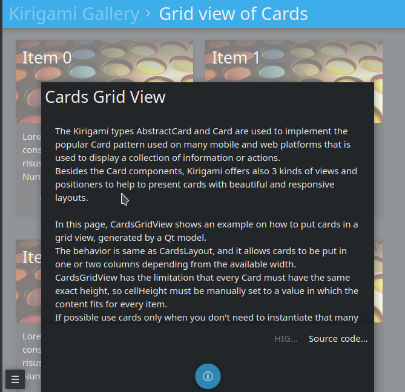

Creating applications for Plasma Mobile with Kirigami
=====================================================

In this tutorial we will use some of the technologies already presented in the `application development <AppDevelopment.html>`_ section. Before starting, you should follow the instructions in that page since the hellokirigami prototype will be used as a skeleton for our development.

Renaming the prototype
~~~~~~~~~~~~~~~~~~~~~~~

At first, we will change the name used in the plasma-mobile-app-template from hellokirigami to kirigami-tutorial:

::

   sed -i 's/org.kde.hellokirigami/org.kde.kirigami-tutorial/g;s/[Hh]ello[Kk]irigami/kirigami-tutorial/g' $(find . -name "CMakeLists.txt" -or -name "*.desktop" -or -name "*.xml" -or -name "*.json"  -or -name *.cpp)

   for file in $(find . -name "org.kde.hellokirigami*"); do mv $file $(echo $file | sed 's/org.kde.hellokirigami/org.kde.kirigami-tutorial/g'); done
   
Objective
~~~~~~~~~
Our goal is to create a simple prototype of an address book. We need to display a grid of cards that will show the contacts of our phone. Each card should display the name of the contact, her/his mobile phone and the email address. 

Kirigami Gallery
~~~~~~~~~~~~~~~~
Now that the requirements of our project have been defined we need to find out the technologies that will help us to create the prototype. In this task `Kirigami Gallery <https://cgit.kde.org/kirigami-gallery.git/>`_ will be our friend. Kirigami Gallery is an application which uses the features of Kirigami, provides links to the source code, tips on how to use the components as well as links to the corresponding HIG pages.

.. tip:: Before continuing please install Kirigami Gallery. It should already be in the repository of your GNU Linux distribution.

Looking for a card layout
^^^^^^^^^^^^^^^^^^^^^^^^^
Navigating through the Kirigami Gallery application, we will stumble upon the "Grid view of cards" gallery component. This is a good candidate that serves our purpose; to display a grid of contact cards.

.. figure:: kirigami-tutorial-1.png
   :scale: 50 %
   :alt: kirigami components

   List of kirigami gallery components
   
   
After selecting the "Grid view of cards" gallery component, we will click to the bottom action and we will get some useful information about the Card and Abstract Card types. 

   Kirigami gallery grid view

In this information dialog we will also find a link to the source code of the Cards Grid View. Let's navigate to this page.

Implementing the card layout
~~~~~~~~~~~~~~~~~~~~~~~~~~~~
We will reuse the most of the code found in the Cards Grid View Gallery `source code page <https://cgit.kde.org/kirigami-gallery.git/tree/src/data/contents/ui/gallery/CardsGridViewGallery.qml>`_. In particular, we will remove the extra parts of the OverlaySheet (which is the implementation of the Kirigami Gallery that helped us reach the kirigami-gallery source code repository).

So, we are going to substitute the Page component of main.qml of the skeleton app with the below Scrollable Page:

::

   Kirigami.ScrollablePage {
   
     title: "Address book (prototype)"
     
     Kirigami.CardsGridView {
        id: view
        
        model: ListModel {
            id: mainModel
        }
                
        delegate: card
     }
   }

What we have done so far is to create a ScrollablePage and put into it a CardsGridView, since we want to display a grid of Cards generated from a model. The data of each contact is provided by a `ListModel <https://doc.qt.io/qt-5/qml-qtqml-models-listmodel.html>`_ while the card delegate is responsible for the presentation of the data. For more info about models and views in Qt Quick, see `here <https://doc.qt.io/qt-5/qtquick-modelviewsdata-modelview.html>`_.

Now let's populate the model that will feed our grid view with data. In Kirigami.ScrollablePage definition, just after:

::

      delegate: card
    }
     
add the below: 

::

    Component.onCompleted: {
        mainModel.append({"firstname": "Pablo", "lastname": "Doe", "cellphone": "6300000002", "email" : "jane-doe@example.com", "photo": "qrc:/konqi.jpg"});
        mainModel.append({"firstname": "Paul", "lastname": "Adams", "cellphone": "6300000003", "email" : "paul-adams@example.com", "photo": "qrc:/katie.jpg"});
        mainModel.append({"firstname": "John", "lastname": "Doe", "cellphone": "6300000001", "email" : "john-doe@example.com", "photo": "qrc:/konqi.jpg"});
        mainModel.append({"firstname": "Ken", "lastname": "Brown", "cellphone": "6300000004", "email" : "ken-brown@example.com", "photo": "qrc:/konqi.jpg"});
        mainModel.append({"firstname": "Al", "lastname": "Anderson", "cellphone": "6300000005", "email" : "al-anderson@example.com", "photo": "qrc:/katie.jpg"});                        
        mainModel.append({"firstname": "Kate", "lastname": "Adams", "cellphone": "6300000005", "email" : "kate-adams@example.com", "photo": "qrc:/konqi.jpg"});                        
    }

The model part of our implementation is ready. Let's proceed to defining a delegate that will be responsible for displaying the data. So, we add the below code to the main.qml page, just after the Component.onCompleted definition:

::

    Component {
        id: card

        Kirigami.Card {

            height: view.cellHeight - Kirigami.Units.largeSpacing

            banner {
                title: model.firstname + " " + model.lastname
                titleIcon: "im-user"
            }

            contentItem: Column {
                id: content

                spacing: Kirigami.Units.smallSpacing

                Controls.Label {
                    wrapMode: Text.WordWrap
                    text: "Mobile: " + model.cellphone
                }

                Controls.Label {
                    wrapMode: Text.WordWrap
                    text: "Email: " + model.email
                }
            }
        }
    }

Following the relative information in the `api page <https://api.kde.org/frameworks/kirigami/html/classorg_1_1kde_1_1kirigami_1_1Card.html>`_ we populate a "banner" (although without an image yet), that will act as a header that will display the name of the contact as well as a contact icon.

The main content of the card has been populated with the cell phone number and the email of the contact, structured as a `column <https://doc.qt.io/qt-5/qml-qtquick-column.html>`_ of `labels <https://doc.qt.io/qt-5/qml-qtquick-controls2-label.html>`_. 

The application should look like this:

.. figure:: kirigami-tutorial-3.png
   :scale: 50 %
   :alt: simple grid without actions

   Simple grid of cards

.. tip:: You can find the full source code of the tutorial at `invent.kde.org <https://invent.kde.org/dkardarakos/kirigami-tutorial>`_.

As a last step we will add some dummy functionality to each card. In particular, a "call" action will be added. Nevertheless, instead of a real call, a passive notification will be displayed. So, let's change the card Component to the below:

::

    Component {
        id: card

        Kirigami.Card {
                                    
            height: view.cellHeight - Kirigami.Units.largeSpacing
            
            banner {
                title: model.firstname + " " + model.lastname      
                titleIcon: "im-user"
            }
                    
            contentItem: Column {
                id: content

                spacing: Kirigami.Units.smallSpacing
                
                Controls.Label {
                    wrapMode: Text.WordWrap
                    text: "Mobile: " + model.cellphone
                }
                
                Controls.Label {
                    wrapMode: Text.WordWrap
                    text: "Email: " + model.email
                }
            }
                
            actions: [
                Kirigami.Action {
                    text: "Call"
                    icon.name: "call-start"
                    
                    onTriggered: { showPassiveNotification("Calling " + model.firstname + " " + model.lastname + " ...") }
                }                                        
            ]
        }

So, we added an `action <https://api.kde.org/frameworks/kirigami/html/classorg_1_1kde_1_1kirigami_1_1Action.html>`_  that, as soon as it is triggered (by pressing the action button), a `passive notification <https://api.kde.org/frameworks/kirigami/html/classorg_1_1kde_1_1kirigami_1_1AbstractApplicationWindow.html#a0a31a7c36993433b260f27ef9b7b9be1>`_ is displayed.

Finally, our application should look like this:

.. figure:: kirigami-tutorial-4.png
   :scale: 50 %
   :alt: grid with actions

   Grid with calling action triggered
        
